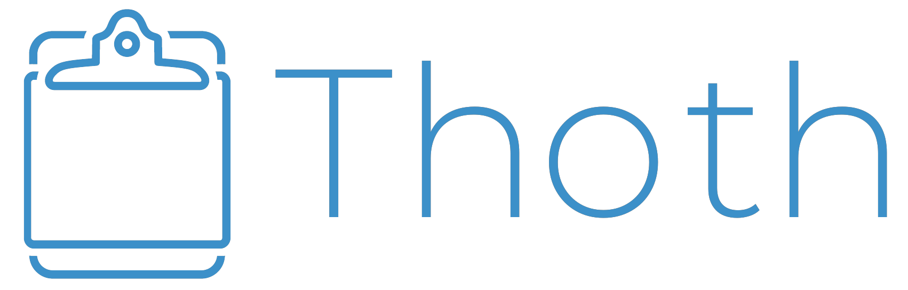

<div align="center">
  
</div>

<br>

**Thoth（トート）** は macOS 向けのクリップボード拡張アプリです。オリジナルの [Clipy](https://github.com/Clipy/Clipy) から派生し、セキュアアイテム管理・パスワード生成・ファイル暗号化などの機能を追加した個人向けの拡張版です。

> For English, see [README.md](README.md).

---

## 1. このアプリケーションについて

本プロジェクトは、OSS として公開されている macOS 向けクリップボード拡張アプリ **[Clipy](https://github.com/Clipy/Clipy)**（MIT ライセンス）を派生（フォーク）し、機能拡張したものです。

オリジナルの Clipy が提供するクリップボード履歴・スニペット機能はそのままに、以下の機能を追加しています。

- **セキュアアイテム管理** — パスワード・TOTP などの機密情報を、クリップボードに残さず直接貼り付け。関連する URL やメモもまとめて管理できます
- **パスワード生成** — 条件を指定したランダムパスワードの生成
- **ファイル暗号化 / 復号化** — openssl 互換形式でのファイル・フォルダ暗号化

### アプリ名「Thoth」について

本アプリは当初 Clipy のフォークとして開発を始めましたが、独自機能の追加が進み差分が明確になったこと、そしてオリジナル開発者の「派生物には Clipy の名称を使用しないでほしい」という意向を尊重し、アプリ名を **Thoth（トート）** に変更しました。

Thoth は古代エジプト神話に登場する**書記・記録・知恵の神**の名前です。あらゆる言葉を書き留め、秘密の知識を守るこの神の名は、クリップボードの記録と機密情報の管理を担う本アプリにふさわしいと考えました。また、日本語では「トートバッグ」と同じ響きであることから、「色々なもの（情報）をざっくり放り込める袋」という意味も込めています。なお、ヒエログリフ表示モード（ジョーク機能）では、トート神の古代エジプト語名「ジェフティ」の綴り 𓍹𓆓𓎛𓅱𓏏𓇋𓍺 でアプリ名が表示されます。

### 謝辞

素晴らしいアプリケーションを OSS として公開してくださった Clipy の開発者の皆様、およびその源流である [ClipMenu](https://github.com/naotaka/ClipMenu) を公開してくださった [@naotaka](https://github.com/naotaka) さんに、深く感謝いたします。本プロジェクトは、これらの先人の成果の上に成り立っています。

本アプリは MIT ライセンスのもとで提供されています。ライセンスの帰属表記および元開発者のクレジットは、ソースコードおよびコミット履歴にそのまま保持しています。

> 開発環境・ビルド方法など開発者向けの情報は [docs/DEVELOPMENT_JP.md](docs/DEVELOPMENT_JP.md) を、
> データ形式・暗号仕様・設計方針は [docs/DESIGN_JP.md](docs/DESIGN_JP.md) を参照してください。

---

## 2. 提供する機能

### 2-1. クリップボード履歴・スニペット（オリジナル Clipy 由来）

コピーした内容の履歴を保持し、メニューから選んで再度貼り付けられます。よく使う定型文はスニペットとして登録できます。

**使い方:**

- コピー（⌘C）した内容は自動的に履歴に蓄積されます
- ホットキーでメニューを開き、項目を選ぶと最前面のアプリへ貼り付けられます

| メニュー | デフォルトホットキー |
|---|---|
| メインメニュー（検索 + 履歴 + スニペット + ツール + 設定） | **⌘⇧V** |
| コピー履歴ウィンドウ（検索 + 履歴のみ） | **⌘⌃V** |
| スニペットメニュー | **⌘⇧B** |

- メインメニューとコピー履歴ウィンドウは、上部に検索ボックスを備えたパネルとして表示されます（ステータスバーアイコンのクリックでもメインメニューが開きます）
- コピー履歴は 10 件ごとのグループ（`0 - 9`、`10 - 19`...）で表示され、カーソルを当てるとサブメニューに内容が表示されます。サブメニュー内では数字キー `0`〜`9` でアイテムを直接選択できます
- `/` キーで検索ボックスに移り、インクリメンタルサーチで履歴を絞り込めます。検索対象はタイトルだけでなく**コピー内容の全文**で、ヒットは元の位置のグループに表示されます
- メニュー内では矢印キーおよび vim 風の `hjkl` キーで移動できます
- 履歴の最大保持数・表示形式・除外アプリなどは環境設定で調整できます（→ [4. 各種設定](#4-各種設定)）

### 2-2. セキュアアイテム機能

パスワードや TOTP などの機密情報を、**クリップボードに一度も置かずに**任意のアプリへ直接貼り付ける機能です。項目は macOS のキーチェーンに暗号化して保存され、メニューを開くたびに Touch ID / パスワード認証が行われます。

**使い方:**

- ホットキーで認証 → セキュアメニューを開き、親アイテム → 項目の順に選ぶと最前面のアプリへ直接貼り付けられます

| メニュー | デフォルトホットキー |
|---|---|
| セキュアメニュー | **⌘⇧.** |

- メニュー内では矢印キーおよび vim 風の `hjkl` キーで移動できます
- `/` キーで検索ボックスに移り、インクリメンタルサーチでアイテムを絞り込めます
- ホットキーは **環境設定 → Shortcuts → Secure Menu** で変更できます

| 特徴 | 詳細 |
|---|---|
| **キーチェーン保存** | すべての値は `kSecAttrAccessibleWhenUnlockedThisDeviceOnly` で保存され、iCloud には同期されません |
| **生体認証ロック** | メニュー表示前に Touch ID（またはログインパスワード）認証が必要。認証成功から 30 秒以内は再認証が省略され、ID・パスワード・TOTP を連続して選択できます |
| **2段階メニュー** | 親アイテム（例: "GitHub"）→ 具体的な項目（例: "Password"）の順で選択 |
| **直接貼り付け** | 選択した値はクリップボードを触らず最前面のアプリへ貼り付け。TOTP はキー入力を直接送出するため、どの履歴にも残りません |
| **続けて貼り付けモード** | 30 秒以内にメニューを再度開くと、前回選択した項目が自動でハイライトされます |
| **TOTP 対応** | otpauth URI / QR コードから登録でき、選択時にその場でワンタイムコードを生成して入力します |

**フィールドの種別:**

1 つのアイテムには複数のフィールドを登録でき、それぞれ次の種別を選べます。

| 種別 | 用途 | 選択パネル（⌘⇧.）での扱い |
|---|---|---|
| **テキスト** | ID など通常の値 | 表示・貼り付け可 |
| **パスワード** | マスク表示したい値 | `••••••••` で表示・貼り付け可 |
| **URL** | ログイン先のアドレス | `🔗` 付きで表示・貼り付け可。確認ウィンドウからブラウザで開けます |
| **メモ** | 契約番号・問い合わせ先・用途などの複数行メモ | **表示されません**（長文のため確認ウィンドウ専用） |
| **TOTP** | ワンタイムパスワード | 現在のコードと残り秒数を表示・入力可 |

**ステップ1 — 認証情報を登録する**

メインメニュー（**⌘⇧V**）→「**セキュア情報**」（メニュー表示中に `s` キーでも起動）を選ぶと、Touch ID / パスワード認証のあと**セキュア情報ウィンドウ**が開きます。

左のペインでアイテムを選び、右のペインで内容を編集します。

1. 左下の **+** でアイテムを追加し、**タイトル**を入力（例: "GitHub", "AWS Console"）
2. 右下の「**フィールドを追加**」から種別（テキスト / パスワード / URL / メモ）を選ぶ
3. **ラベル**（例: "Password"）と**値**を入力
4. TOTP を追加する場合は「**TOTP追加...**」から otpauth URI / QR コードを取り込み
5. 編集内容は自動で保存されます（**⌘S** で明示的に保存することもできます）

| 操作 | キー |
|---|---|
| アイテムの選択を上下に移動 | `j` / `k` |
| アイテム・フィールドの並べ替え | `Ctrl+j` / `Ctrl+k` |
| 右のペインへ移動 / 一覧へ戻る | `l`・`→`・`Return` / `h`・`←` |
| 検索 | `/` または `⌘F` |
| アイテムの追加 / 削除 | `⌘N` / `⌘⌫` |
| 保存 / ウィンドウを閉じる | `⌘S` / `⌘W`・`Esc` |

> **セキュアアイテム管理ウィンドウ**（選択パネル表示中に `p` キー）も引き続き利用できます。こちらは一覧と Export / Import に対応した従来の画面です。

**ステップ2 — 認証情報を貼り付ける**

1. 対象アプリの入力欄にカーソルを合わせる
2. ホットキー（デフォルト: **⌘⇧.**）を押すと Touch ID / パスワード認証ダイアログが表示される
3. 認証後、2段階メニューが開く
4. 親アイテム → 貼り付けたい項目の順に選択

**セキュリティ上の性質:**

- 値は認証時にのみキーチェーンから読み込まれます
- 通常項目の貼り付けにはクリップボードを一時利用しますが、履歴に残らないマーカー（`org.nspasteboard.ConcealedType`）を付与し、貼り付け後に自動でクリアします
- TOTP はクリップボードを一切経由せず、キー入力として直接送出します
- セキュア情報ウィンドウは値を平文で表示するため、次の保護をかけています
  - 表示前に Touch ID / パスワード認証が必要
  - パスワードは常にマスク表示。👁 で一時的に平文にできますが **30 秒で自動的に伏せ字へ戻ります**。ウィンドウが非アクティブになったときも即座に戻ります
  - TOTP は secret を画面に出さず、その時点のコードだけを表示します
  - **画面共有・画面収録から除外**されます（会議の画面共有に映り込むのを防ぐため。その代わりスクリーンショットにも写りません）
  - 画面ロック・スリープでウィンドウを自動的に閉じ、閉じたあとはメモリ上の内容も破棄します
  - 値のコピーもクリップボード履歴に残らないマーカー付きで行い、一定時間後に自動クリアします

### 2-3. パスワード生成機能

条件を指定してランダムなパスワードを生成します。乱数は OS の CSPRNG（`SecRandomCopyBytes`）から取得します。

**使い方:**

メインメニューの「**新しいパスワードを生成**」（メニュー表示中に `p` キーでも起動）を選ぶと生成ウィンドウが開きます。

- **文字数**: スライダーまたは数値で指定
- **文字種**: 半角英字 / 数字 / 記号 / 大文字小文字を区別、を任意に組み合わせ
- **入力しやすいパスワード**: 文字種ごとにブロック化し、スマートフォン等での入力時の文字種切り替えを減らすモード
- 「**コピー**」で生成結果をクリップボードにコピー（秘匿マーカー付き・一定時間後に自動クリア）
- 生成結果の下に **QR コード**が表示され、スマートフォンで撮影して持ち出せます（→ [2-4 の「QR コードによる指紋パスワードの受け渡し」](#qr-コードによる指紋パスワードの受け渡し)）

セキュアアイテム編集画面や指紋パスワード管理画面からも、パスワード生成を呼び出せます。

### 2-4. ファイル暗号化 / 復号化機能

ファイルやフォルダをパスワードで暗号化・復号します。暗号化はすべてアプリ内で完結し（外部コマンドにパスワードを渡しません）、**openssl 互換のコンテナ形式**を採用しているため、Thoth が無い環境でも `openssl` コマンドだけで復号できます。

**使い方:**

メインメニューの「**暗号化 / 復号化**」（メニュー表示中に `e` キーでも起動）を選ぶとウィンドウが開きます。

1. 「選択...」で対象ファイル / フォルダを指定
2. パスワードを入力（指紋アイコンから、登録済みの固定パスワードを Touch ID で呼び出すことも可能）
3. 「暗号化」（⌘E）または「復号化」（⌘D）を実行
4. 暗号化後は、ウィンドウ内に openssl での復号コマンド例が表示されます（「コマンドをコピー」で取得可能）

- 暗号化ファイルの拡張子は `.enc`
- フォルダは tar でまとめてから暗号化され、復号時に自動展開されます

#### QR コードによる指紋パスワードの受け渡し

指紋パスワード（Touch ID で呼び出せる固定パスワード）を別の端末へ引き渡すための QR コード機能です。共通パスワードで暗号化したファイルを複数端末でやり取りする際に、パスワード文字列を平文のメール等で送らずに済みます。

**使い方（渡す側 → 受け取る側）:**

1. 指紋パスワード管理ウィンドウ（「暗号化 / 復号化」ウィンドウ →「**指紋パスワード管理...**」）を開き、Touch ID 認証する
2. パスワード欄の下に、入力内容から生成された **QR コードがリアルタイム表示**される
3. QR コードを**スマートフォンで撮影**して持ち運ぶ
4. 受け取り側の Mac で同じ管理ウィンドウを開き、「**QRコード読取り**」ボタンを押す（初回はカメラへのアクセス許可が必要）
5. カメラにスマートフォンの QR コード写真をかざすと、読み取られたパスワードが欄に入力される
6. 内容を確認して「**登録・更新**」で保存する

- QR コードには `thoth-cpw:v1:` という接頭辞付きでパスワードが埋め込まれ、読取り時に検証されるため、無関係な QR コード（TOTP の otpauth など）を誤って取り込むことはありません
- 新規パスワード生成ウィンドウ（[2-3](#2-3-パスワード生成機能)）にも同じ形式の QR コードが表示されるため、「生成 → 撮影 → 別端末で読取り登録」という流れで新しい共通パスワードを配布できます

> **注意:** QR コードはパスワードそのものを表現します。撮影した写真の取り扱い（クラウド同期・共有など）には注意し、受け渡しが済んだら写真を削除することをお勧めします。

#### openssl コマンドでの復号（Thoth が無い環境での復旧）

暗号化ファイルは「45 バイトの独自ヘッダー」+「標準の `openssl enc` 出力」という構造です。**先頭 45 バイトのヘッダーを取り除いてから** openssl に渡します（そのまま渡すと `bad magic number` エラーになります）。

```sh
# ファイルの復号（反復回数の既定値は 200000）
tail -c +46 secret.txt.enc | openssl enc -d -aes-256-cbc -pbkdf2 -iter 200000 \
  -pass pass:パスワード -out secret.txt

# フォルダの場合、出力は tar アーカイブになる
tail -c +46 myfolder.enc | openssl enc -d -aes-256-cbc -pbkdf2 -iter 200000 \
  -pass pass:パスワード -out myfolder.tar && tar -xf myfolder.tar
```

#### openssl で暗号化したファイルを本アプリで復号する

本アプリは、`openssl enc` が出力した標準形式のファイルも読み込めます（本アプリの独自ヘッダーが無くても、旧形式として自動判別します）。openssl 側で次のように暗号化したファイルは、本アプリの「復号化」で開けます。

```sh
# openssl で暗号化（本アプリで復号可能な形式）
openssl enc -aes-256-cbc -pbkdf2 -iter 100000 -salt \
  -in secret.txt -out secret.txt.enc -pass pass:パスワード
```

> **補足:**
> - 本アプリ内での復号は、独自ヘッダーの HMAC-SHA256 タグを事前検証（Encrypt-then-MAC）するため、改竄や誤パスワードを確実に検知します。openssl CLI での復号はこの検証を通りません（誤パスワードの大半は CBC のパディングエラーで検出されます）。
> - 暗号化コンテナ形式の詳細な仕様は [docs/DESIGN_JP.md](docs/DESIGN_JP.md) を参照してください。

---

## 3. インストール方法・実行方法

配布バイナリは提供していないため、ソースからビルドして使用します。ビルド手順の詳細は [docs/DEVELOPMENT_JP.md](docs/DEVELOPMENT_JP.md) を参照してください。

**動作要件:** macOS 11.0 以降 · Apple Silicon (arm64)

**概略:**

1. リポジトリを clone
2. 依存関係をインストール（`bundle exec pod install`）
3. ビルド（`Thoth.xcworkspace` を Xcode で開くか、CLI で `xcodebuild`）
4. 生成された `Thoth.app` を `/Applications` などに配置して起動

**初回起動時の注意:**

- 本アプリは Apple の公証（notarization）を受けていないため、他の Mac にコピーして初回起動すると Gatekeeper に「開発元を確認できません」等でブロックされます（下記「初回起動時の Gatekeeper アラートへの対応」を参照して許可してください。初回のみ）。
- 本アプリは起動時にデバイス固有の証明書で自身を自動的に再署名し、その後アプリを再起動します（セキュアアイテムをバージョンをまたいで読み出せるようにするため）。初回のみ macOS の確認ダイアログが表示されることがあるので「常に許可」を選択してください。
- 再署名後、**アクセシビリティ権限の付与**が必要です（ペースト機能に必須。以後のバージョンアップでは再付与不要）。
- 詳細は [docs/DEVELOPMENT_JP.md](docs/DEVELOPMENT_JP.md) の「コード署名とアクセシビリティ権限」を参照してください。

**要求される権限について:**

| 権限 | 必須か | 用途 |
|---|---|---|
| アクセシビリティ | 必須 | ペースト（⌘V 送出・キー入力）に使用 |
| **デスクトップフォルダ** | **任意** | ベータ機能の「スクリーンショットを監視」を有効にした場合のみ要求。macOS はスクリーンショットを既定でデスクトップに保存するため、その追加を検知するのにデスクトップの走査権限が必要になる |

> デスクトップフォルダへのアクセスは**「スクリーンショットを監視」機能を有効にした場合にのみ**求められます（既定では無効）。この機能を使わない場合は拒否して構いません。クリップボード履歴・スニペット・セキュアアイテム・暗号化・パスワード生成など他の機能はすべて影響なく動作します。

### 初回起動時の Gatekeeper アラートへの対応

他の Mac に配布した Thoth を初めて起動すると、「"Thoth" は開いていません」「Apple は…マルウェアが含まれていないことを検証できませんでした」というアラートが表示され、選択肢が「ゴミ箱に入れる」「完了」しか出ないことがあります（最近の macOS）。これは公証がないアプリの既定のブロックであり、以下のいずれかで**初回のみ**許可すれば起動できます。以降は通常どおり起動します。

まず、そのアラートは **「完了」**（「ゴミ箱に入れる」ではない）で閉じてください。

**方法A: GUI（システム設定）**

1. アップルメニュー → **システム設定** → **プライバシーとセキュリティ** を開く
2. 画面を下にスクロールすると **「"Thoth" は開発元を確認できないため使用がブロックされました」** という文言と **「このまま開く」** ボタンが表示されるので、それをクリック
3. Touch ID またはパスワードで認証する
4. 再度確認ダイアログが出たら **「開く」** を選択

**方法B: CLI（ターミナル）**

アプリに付与された検疫属性（quarantine）を取り除きます。以下は `/Applications` に配置した場合の例です（配置先に合わせてパスを変更してください）。

```sh
xattr -dr com.apple.quarantine /Applications/Thoth.app
```

実行後、`Thoth.app` をダブルクリックすれば通常どおり起動します。属性が付いているか確認するには次を実行します（何も表示されなければ検疫属性はありません）。

```sh
xattr -p com.apple.quarantine /Applications/Thoth.app 2>/dev/null
```

> **補足:** これらの操作が必要なのは公証を受けていないためです。将来 Apple Developer Program（有償）で Developer ID 署名 + 公証を行えば、この手順は不要になります。

---

## 4. 各種設定

環境設定ウィンドウ（メニューバーアイコン →「環境設定」）で以下を調整できます。

| カテゴリ | 主な設定項目 |
|---|---|
| **General** | ログイン時の自動起動、履歴の最大保持数、貼り付け後の挙動 など |
| **Menu** | メニューに表示する項目数（インライン / フォルダ内）、番号付け、アイコン・画像・ツールチップ・カラープレビューの表示、タイトルの最大長 など |
| **Type** | 履歴として保存するデータ型（文字列 / RTF / PDF / 画像 / ファイル名 / URL など）の選択 |
| **Shortcuts** | 各メニュー（メイン / 履歴 / スニペット / セキュアメニュー）を呼び出すホットキーの割り当て |
| **オリジナル** | フォーク元であるオリジナル Clipy への謝辞・リポジトリリンク・バージョン表記 |
| **Excluded** | クリップボード履歴の取得を除外するアプリケーションの登録 |

- **除外アプリ**: パスワードマネージャーなど、履歴に残したくないアプリを登録できます。また、`org.nspasteboard.ConcealedType` などの秘匿マーカーが付いたコピー（他のパスワードマネージャー由来のコピーなど）は、除外設定に関わらず自動的に履歴保存されません。
- **セキュアアイテムの Export / Import**: Manage Secure Items ウィンドウから、セキュアアイテムと指紋パスワードを JSON ファイルとして書き出し / 読み込みできます。複数端末で同じ情報を利用する用途に使えます（**書き出しファイルは平文のため取り扱いに注意してください**）。書き出されるファイルのスキーマは [docs/DESIGN_JP.md](docs/DESIGN_JP.md) を参照してください。

---

## ライセンス

本アプリは MIT ライセンスのもとで提供されています。詳細は LICENSE ファイルをご覧ください。アイコンの著作権は、それぞれの作者に帰属します。

## スペシャル・サンクス

**[@naotaka](https://github.com/naotaka) が OSS として [ClipMenu](https://github.com/naotaka/ClipMenu) を公開してくれたこと、そして [Clipy](https://github.com/Clipy/Clipy) の開発者の皆様に感謝します。**
